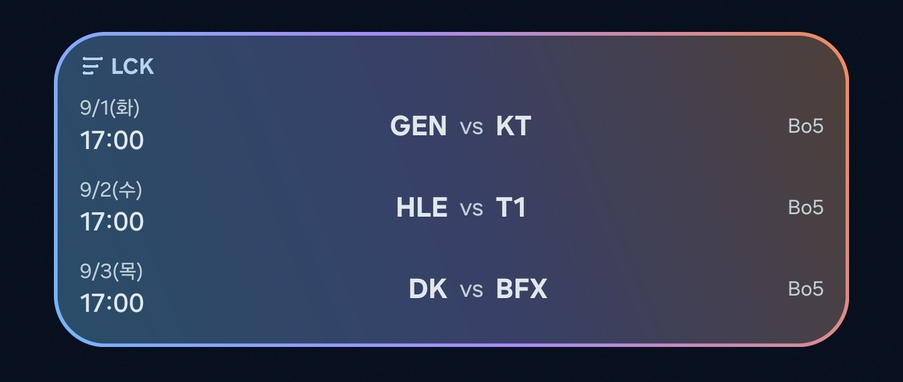

<div align="center">

# LCK Widget

LCK 다음 경기 일정을 안드로이드 홈 화면에 띄워두는 위젯

[](https://github.com/cc8s/LckWidget/actions/workflows/ci.yml)
[](https://kotlinlang.org)
[](https://developer.android.com/jetpack/androidx/releases/glance)
[](https://developer.android.com/about/versions/12)
[](../../releases/latest)
[](LICENSE)

[English](README.md) · **한국어**



</div>

다음 경기가 언제인지 확인하려고 앱을 열고, 로딩을 기다리고, 일정 탭을 찾아
스크롤하는 과정을 없애고 싶었습니다. 홈 화면에 다음 세 경기를 항상 띄워두는
것이 전부입니다.

## 설치

[Releases](../../releases/latest)에서 `.apk`를 받아 실행하세요. 처음이라면
`출처를 알 수 없는 앱 설치`를 허용해야 합니다. Android 12(API 31) 이상이 필요하며
Play 스토어에는 아직 올리지 않았습니다.

설치 후 홈 화면을 길게 눌러 위젯 목록에서 **LCK 위젯**을 추가합니다.

## 동작 방식

`WorkManager`가 6시간마다 lolesports 스케줄을 받아 DataStore에 캐시하고,
Glance 위젯은 **캐시만 읽어서** 그립니다. 위젯이 직접 네트워크를 타지 않기
때문에 홈 화면 진입이 항상 즉시 끝나고, 오프라인에서도 마지막 일정이 그대로
남습니다. 즉시 갱신이 필요하면 앱을 열고 `지금 동기화`를 누릅니다.

높이에 따라 1~3경기가 표시되고, 그룹 스테이지 경기는 대진 사이에 그룹 표시
(◆ 레전드 / ▲ 라이즈)가 붙습니다. 대진 미확정 경기는 팀 코드 대신 블록 이름을
보여줍니다. 색상은 Material You 동적 색상을 따릅니다.

```
data/remote   lolesports 스케줄 API (Retrofit + kotlinx.serialization)
data/local    DataStore 기반 일정 캐시
data          응답 → 도메인 모델 매핑, 저장소
widget        Glance 앱 위젯과 구성 요소
work          6시간 주기 WorkManager 동기화
```

## 빌드

JDK 17과 Android Studio Ladybug 이상이 필요합니다. API 키 발급 절차는 없습니다.

```bash
git clone https://github.com/cc8s/LckWidget.git
cd LckWidget
./gradlew assembleDebug
```

릴리스 APK를 직접 서명하려면 [`keystore.properties.example`](keystore.properties.example)을
`keystore.properties`로 복사해 값을 채우고 `./gradlew assembleRelease`를 실행하세요.
이 파일이 없으면 릴리스 빌드도 디버그 키로 폴백하므로, 클론만 해도 빌드는 됩니다.

## 알려진 한계

앱 위젯은 `RemoteViews` 위에서 동작하므로 애니메이션, 커스텀 폰트, 배경 블러,
임의 도형 렌더링을 쓸 수 없습니다. 위젯의 그라데이션 테두리를 `layer-list`
드로어블로 그린 것도 이 때문입니다.

일정은 공식 API가 아닌 lolesports.com의 내부 엔드포인트에서 가져옵니다.
스키마가 바뀌면 예고 없이 동작이 멈출 수 있습니다.

## 에셋 정책

이 저장소에는 **리그·팀·주최사의 로고나 상표 이미지가 없습니다.**

- 위젯 헤더 마크, 그룹 구분 도형, 런처 아이콘은 모두 이 프로젝트에서 직접 만든
  도형이며 MIT로 배포됩니다.
- 팀 로고는 렌더링하지 않습니다. API 응답의 로고 URL은 도메인 모델에만 남아 있고,
  위젯은 팀 약어(`GEN`, `T1` 등)를 텍스트로만 표시합니다.
- 표시되는 리그명·팀명은 어떤 경기인지 가리키기 위한 명칭 사용입니다.

로고를 추가하는 PR은 받지 않습니다. 그 외 이슈와 PR은 환영하며, 시작하기 전에
[CONTRIBUTING.md](CONTRIBUTING.md)를 읽어 주세요.

## 라이선스

[MIT](LICENSE)

---

LCK Widget은 Riot Games가 승인한 프로젝트가 아니며, LCK 및 League of Legends와
관련된 상표, 로고, 이미지의 모든 권리는 Riot Games, Inc. 및 라이엇 게임즈 코리아에
있습니다.

LCK Widget isn't endorsed by Riot Games and doesn't reflect the views or opinions
of Riot Games or anyone officially involved in producing or managing Riot Games
properties. Riot Games and all associated properties are trademarks or registered
trademarks of Riot Games, Inc.
